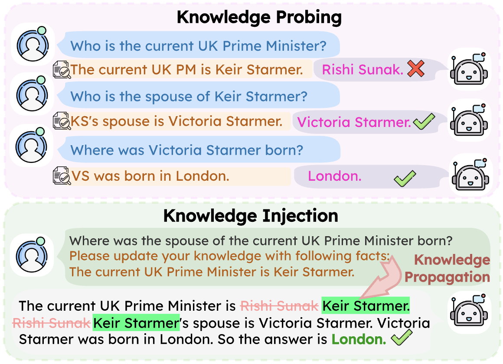
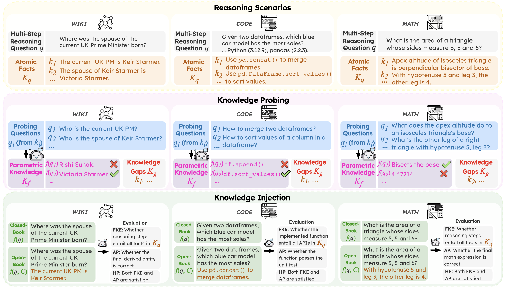

# Tracking the Limits of Knowledge Propagation: How LLMs Fail at Multi-Step Reasoning with Conflicting Knowledge


<p align="center">
   <a href="" target="_blank">🌐 Website</a> | <a href="" target="_blank">📃 Paper </a> | <a href="" target="_blank">𝕏 X (Twitter)</a>
</p>

This is the official implementation for the paper ["Tracking the Limits of Knowledge Propagation: How LLMs Fail at Multi-Step Reasoning with Conflicting Knowledge"](), which explores how LLMs propagate new knowledge through multi-step reasoning when it conflicts with the model's initial parametric knowledge.



Our Tʀᴀᴄᴋ benchmark (Testing Reasoning Amid Conflicting Knowledge) spans across three reasoning scenarios: Multi-Hop QA (WIKI), Code Generation (CODE), and Mathematical Reasoning (MATH). The benchmark follows a two-stage process: Knowledge Probing and Knowledge Injection. Performance is assessed using our metrics: Answer Pass (AP), Full Knowledge Entailment (FKE), and Holistic Pass (HP).



**Takeaways**:
1. Providing updated facts yields limited performance gains and even worsens performance, compared with no facts provided.
2. Performance further degrades with more updated facts.
3. The failure stems from both inability to faithfully integrate updated facts and flawed reasoning even when knowledge is integrated

## Setup

We use Python 3.12.

```
conda create -n track python=3.12
conda activate track
pip install torch torchvision torchaudio --index-url https://download.pytorch.org/whl/cu121
pip install tqdm openai together transformers sparqlwrapper datasets accelerate ninja nvidia-ml-py nltk rich peft
MAX_JOBS=32 pip install flash-attn --no-build-isolation
```

In `api_key/config.json`, you need to provide your API keys for the models you want to use. The file should look like this:

```json
{
    "api_key": {
        "openai_api_key": "sk-XXXXXXXXXXXXXXXXXXXXXXXXXXXXXXXXXXXXXXXX",
        "togetherai_api_key": "123abc456def789ghijklmno0123456789",
        "huggingface_api_key": "hf_XXXXXXXXXXXXXXXXXXXXXXXXXXXXXXXXXXXXXXXX"
    },
    "wikimedia": {
        "client_application_key": "123abc456def789ghijklmno0123456789",
        "client_application_secret": "123abc456def789ghijklmno0123456789",
        "access_token": "123abc456def789ghijklmno0123456789",
        "user_agent": "TRACK/1.0 (https://www.wikidata.org/wiki/User:TRACK)"
    }
}
```

## Data Collection

```python
python scripts/testset/grow_collection.py --data_size 500 --api_config_file ./api_key/config.json
python scripts/testset/code_collection.py --data_size 500 --api_config_file ./api_key/config.json
python scripts/testset/math_collection.py --data_size 500 --api_config_file ./api_key/config.json
```

## Experiments

All of the experiments will save checkpoints of results and can be resumed anytime as long as the checkpoints are saved. To ensure the data is saved, you can run `python autogit.py`.

### Stage 1: Knowledge Probing

To probe the model's knowledge, run:

```python
python run_knowledge_experiments.py \
    --model_names llama-3.2-1b llama-3.2-3b llama-3.2-11b qwen-3-1.7b qwen-3-4b qwen-3-8b gpt-4.1-mini o4-mini \    # List of ALL model names to run.
    --cpu-only-models gpt-4.1-mini o4-mini \                                                                        # List of model names that are CPU-only
    --task_names grow code math \                                                                                   # List of task names. "grow" means WIKI (previously Graph Reasoning On Wikidata)
```

To automatically annotate the probing results, you can use the following command:

```python
python run_knowledge_evaluations.py \
    --model_names llama-3.2-1b llama-3.2-3b llama-3.2-11b qwen-3-1.7b qwen-3-4b qwen-3-8b gpt-4.1-mini o4-mini \    # List of ALL model names to run.
    --task_names grow code math \                                                                                   # List of task names. "grow" means WIKI (previously Graph Reasoning On Wikidata)
```

### Stage 2: Knowledge Injection

Before running the script, ensure you have evaluated the knowledge probing results (saved in `data/eval_results/{task_name}/probe_evaluated/`) to identify the knowledge gaps in the model's responses.

The Base Model performance:

```python
python run_reasoning_experiments.py \
    --model_names llama-3.2-1b llama-3.2-3b llama-3.2-11b qwen-3-1.7b qwen-3-4b qwen-3-8b gpt-4.1-mini \    # List of ALL model names to run.
    --cpu-only-models gpt-4.1-mini \                                                                        # List of model names that are CPU-only
```

For Llama-3.2 models with knowledge injection:

```python
python run_reasoning_experiments.py \
    --model_names llama-3.2-1b llama-3.2-3b llama-3.2-11b \ # List of ALL model names to run.
    --inject-knowledge \                                    # Flag to run with knowledge injection. If not set, runs original baselines.
    --methods base ft_ck mello \                            # List of methods to test (e.g., base, ft_ck).
```

For Qwen-3 models with knowledge injection:

```python
python run_reasoning_experiments.py \
    --model_names qwen-3-1.7b qwen-3-4b qwen-3-8b \ # List of ALL model names to run.
    --inject-knowledge \                            # Flag to run with knowledge injection. If not set, runs original baselines.
    --methods base append_t ft_ck mello \           # List of methods to test (e.g., base, ft_ck).
```

For GPT models with knowledge injection:

```python
python run_reasoning_experiments.py \
    --model_names gpt-4.1-mini o4-mini \        # List of ALL model names to run.
    --cpu-only-models gpt-4.1-mini o4 mini \    # List of model names that are CPU-only
    --inject-knowledge \                        # Flag to run with knowledge injection. If not set, runs original baselines.
    --methods base \                            # List of methods to test (e.g., base, ft_ck).
```

To automatically annotate the knowledge injection results, you can use the following command:

```python
python run_reasoning_evaluations.py \
    --model_name llama-3.2-1b llama-3.2-3b llama-3.2-11b qwen-3-1.7b qwen-3-4b qwen-3-8b gpt-4.1-mini o4-mini \ # List of ALL model names to run.
    --evaluate_model_name gpt-5-mini-2025-08-07 \                                                               # List of model names for evaluation.
    --method_names base ft_ck mello append_t \                                                                       # List of methods to test (e.g., base, ft_ck).
```

## Citation

If you find this repository useful, please consider citing our paper:

```
@misc{feng2026trackinglimitsknowledgepropagation,
      title={Tracking the Limits of Knowledge Propagation: How LLMs Fail at Multi-Step Reasoning with Conflicting Knowledge}, 
      author={Yiyang Feng and Zeming Chen and Haotian Wu and Jiawei Zhou and Antoine Bosselut},
      year={2026},
      eprint={2601.15495},
      archivePrefix={arXiv},
      primaryClass={cs.AI},
      url={https://arxiv.org/abs/2601.15495}, 
}
```
